# Video Studio（课程视频剪辑系统）使用说明书

> **版本**：v1.0（2026-09-30）　**适用系统**：本地部署版（服务端口 7861）
> **访问方式**：启动服务后在浏览器打开 **<http://127.0.0.1:7861/>**
>
> 本说明书基于系统当前实现编写，所有截图均取自真实运行界面（示范任务：1 小时 11 分钟课程视频）。

---

## 目录

1. [系统简介](#1-系统简介)
2. [登录](#2-登录)
3. [首页仪表盘](#3-首页仪表盘)
4. [新建任务](#4-新建任务)
5. [热词库](#5-热词库)
6. [任务列表与任务详情](#6-任务列表与任务详情)
7. [剪辑工作台总览](#7-剪辑工作台总览)
8. [六个阶段详解](#8-六个阶段详解)
9. [执行日志](#9-执行日志)
10. [优化字幕的两个效率工具](#10-优化字幕的两个效率工具)
11. [流程配置（自动执行）](#11-流程配置自动执行)
12. [产物浏览器](#12-产物浏览器)
13. [大模型设置](#13-大模型设置)
14. [用户管理与多人协作](#14-用户管理与多人协作)
15. [常见问题](#15-常见问题)

---

## 1. 系统简介

本系统是一个**课程视频自动化剪辑工作台**：上传课程录像后，系统自动识别字幕、用大模型修订文字、按决策切分视频、合成粗剪成片、再对成片字幕做字词级优化，最终导出带字幕、封面、背景、背景音乐的成品视频。

整个处理过程分为 **6 个阶段**，既可以逐阶段手动操作，也可以在「流程配置」里一键自动执行：

| # | 阶段 | 做什么 |
|---|------|--------|
| 1 | 🎙 字幕生成 | FunASR 识别视频字幕，支持热词与说话人区分 |
| 2 | 📝 字幕修订 | 大模型逐句分析字幕，提出修改建议，人工审核 |
| 3 | ✂️ 切分修剪 | 按修订决策生成保留 / 删除片段清单 |
| 4 | 🎥 粗剪合成 | 按保留区间拼接出粗剪视频（含随片字幕） |
| 5 | ✨ 优化字幕 | 重新识别粗剪成片字幕，大模型提取不明确字词，人工替换 |
| 6 | 🎬 精剪合成 | 按精剪参数导出成品视频（封面 / 背景 / BGM 可选） |

**页面顶栏**（所有页面共用）提供主要入口：📋 任务列表、📚 热词库、➕ 新建任务；右侧是 🚀 上游首页（上游 FunClip 原始界面，端口 7860）、⚙️ 大模型设置、用户管理（仅管理员可见）与登录 / 登出。

---

## 2. 登录

打开系统后，点击顶栏右侧的 **🔑 登录** 按钮，弹出登录窗口：

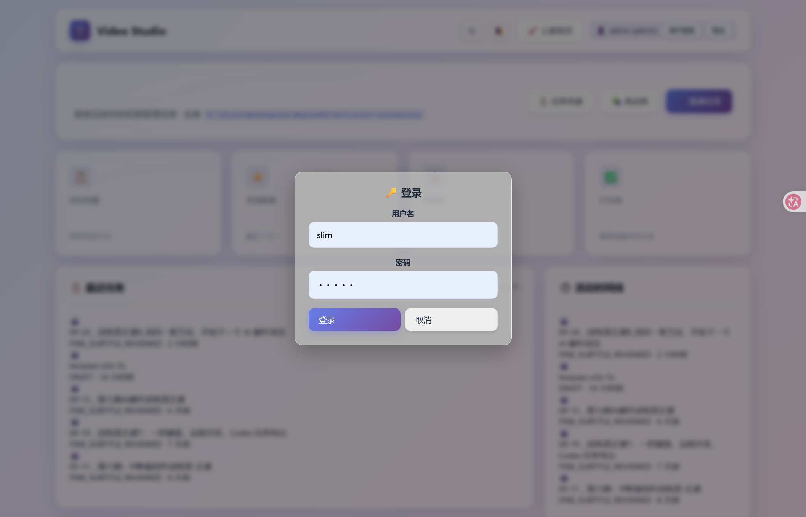

输入用户名与密码后点击「登录」。账号由管理员在「[用户管理](#14-用户管理与多人协作)」中创建；未登录时只能看到页面骨架，无法查看任何任务数据。

**权限说明**：

- **普通用户**：只能看到自己创建（或被添加为成员）的任务及对应统计；
- **管理员（admin）**：可看到全部任务，多出「用户管理」入口，任务列表里可在「我的 / 全部」之间切换。

---

## 3. 首页仪表盘

登录后进入首页，上半部分是 4 张统计卡片，下半部分是最近任务与活动时间线：

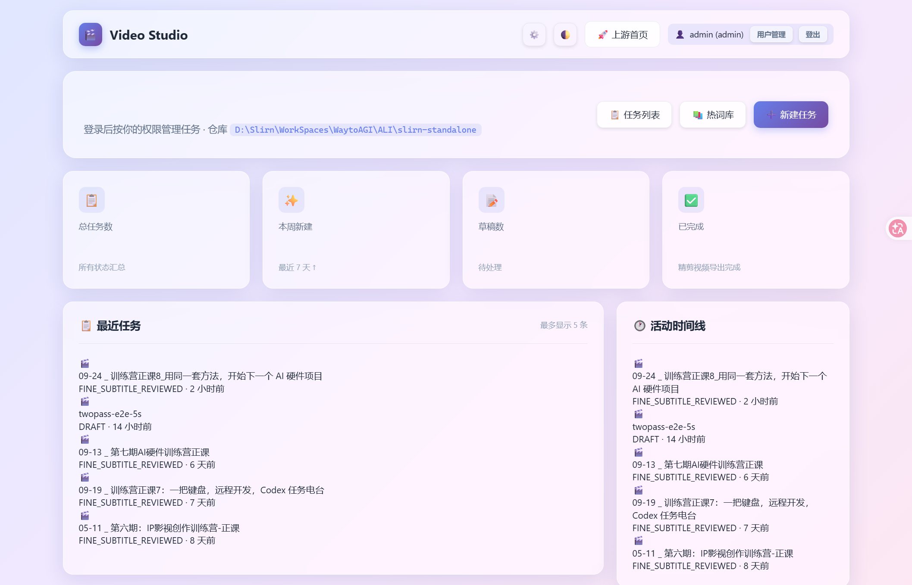

| 卡片 | 含义 |
|------|------|
| 📋 总任务数 | 当前可见范围内的全部任务（普通用户 = 自己的任务） |
| ✨ 本周新建 | 最近 7 天创建的任务数 |
| 📝 草稿数 | 尚未开始处理的任务 |
| ✅ 已完成 | 精剪视频导出完成的任务 |

点击任意统计卡片可跳转任务列表；点击「最近任务」中的条目可直接进入该任务详情。

---

## 4. 新建任务

点击顶栏 **➕ 新建任务**，按三步创建：

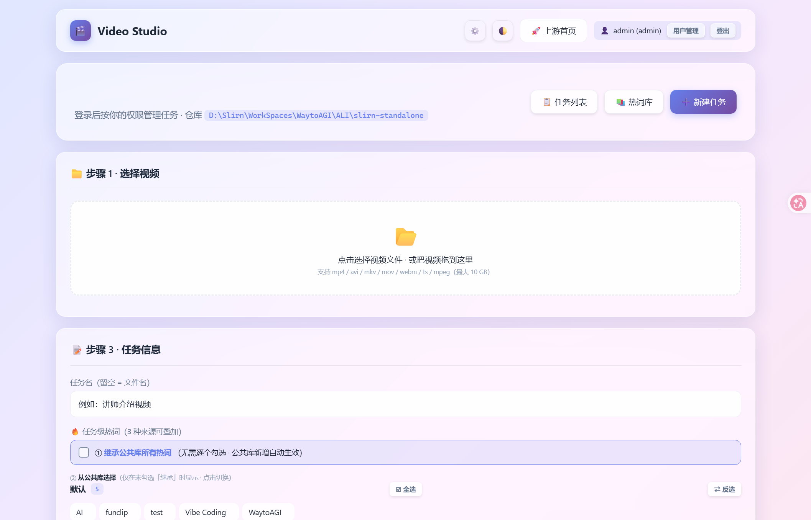

**步骤 1 · 选择视频**：点击虚线框选择文件，或直接把视频拖进去。支持 mp4 / avi / mkv / mov / webm / ts / mpeg，最大 10 GB。

**步骤 2 · 视频预览 + 时间设置**：上传后出现播放器。拖动滑块或直接播放定位到目标位置，点 **⏱ 设为开始** / **⏱ 设为结束**（也可手动输入 HH:MM:SS.mmm 格式时间）。只剪一部分时，点「🎬 待剪辑视频预览」可先预览截取段。**不需要截取就留空 = 全片**。

**步骤 3 · 任务信息**：

- **任务名**：留空则自动使用视频文件名。
- **🔥 任务级热词**（三种来源可叠加）：
  1. 勾选 **「继承公共库所有热词」** —— 公共库之后新增的词也会自动生效（推荐）；
  2. **从公共库选择** —— 在网格中点击要用的词（未勾选继承时显示）；
  3. **手动输入** —— 半角逗号或换行分隔，直接粘贴专有名词。
- **🤖 AI 热词分析**（默认折叠）：展开后描述课程主题（例：*这是一档讲 RAG 与向量数据库的播客，主持人叫张老师*），可选粘贴参考资料 URL，点「🔍 分析」后从候选词中挑选，一键加入任务或公共库。
- 下方 **「✅ 最终生效的热词」** 实时汇总三种来源的结果，点 ✕ 可移除单个词。

**👥 成员管理**（可折叠）：把其他用户加为任务成员，成员即可查看 / 编辑该任务，任务也会出现在对方的任务列表里。

最后点 **✅ 创建任务**。

> 事后修改：任务列表 → ✏️ 编辑，可改任务名、时间截取与热词（原视频不可更换），保存后可一键「✂️ 进入剪辑工作台」。

---

## 5. 热词库

热词是提高专有名词识别准确率的关键。点击顶栏 **📚 热词库** 管理公共库：

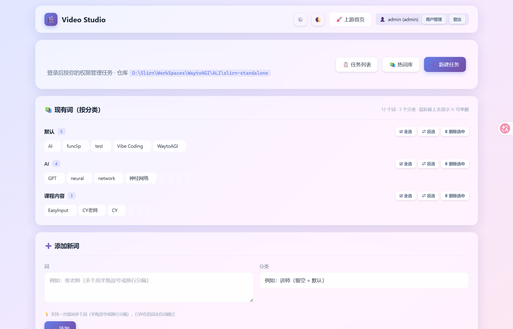

- **现有词（按分类）**：每个分类一个网格；鼠标移到词上出现 ✕ 可单删；分类标题行提供 **☑ 全选 / ⇄ 反选 / 🗑 删除选中** 批量操作。
- **➕ 添加新词**：一次可粘贴多个词（半角逗号或换行分隔），填分类（留空 = 默认），已存在的词自动跳过。

建议按「讲师名 / 课程术语 / 机构名」等维度建分类；新任务勾选「继承公共库所有热词」即可全程受益。

---

## 6. 任务列表与任务详情

### 任务列表

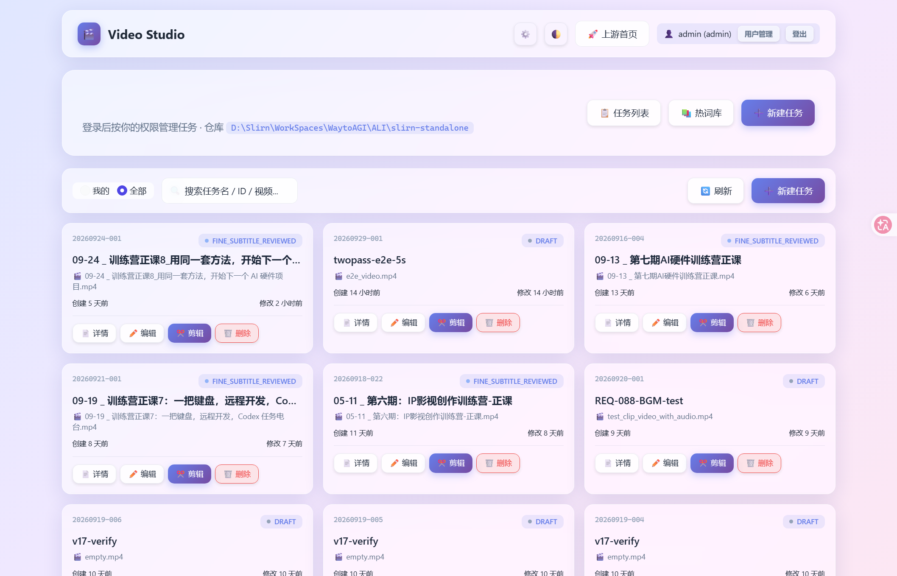

顶部工具栏：管理员可在 **我的 / 全部** 间切换范围；搜索框支持按任务名 / ID / 视频文件名模糊搜索；🔄 刷新手动更新列表。

每张任务卡显示：任务 ID、状态徽章（带彩色圆点）、任务名、原始视频文件、创建 / 修改时间，以及四个操作：

| 按钮 | 作用 |
|------|------|
| 📄 详情 | 打开任务详情页 |
| ✏️ 编辑 | 回到新建任务页的编辑模式（改名 / 时间 / 热词） |
| ✂️ 剪辑 | 直接进入剪辑工作台（最常用） |
| 🗑️ 删除 | 删除任务（有确认提示） |

### 任务详情

详情页列出任务 ID、任务名、状态、原始视频、截取段、热词、创建 / 修改时间等全部元信息，下方直接嵌入「字幕生成」工作区，可以就地开始第一步处理，也可以点按钮跳到对应阶段。

---

## 7. 剪辑工作台总览

从任务卡点 **✂️ 剪辑** 进入工作台——这是日常操作的主界面：

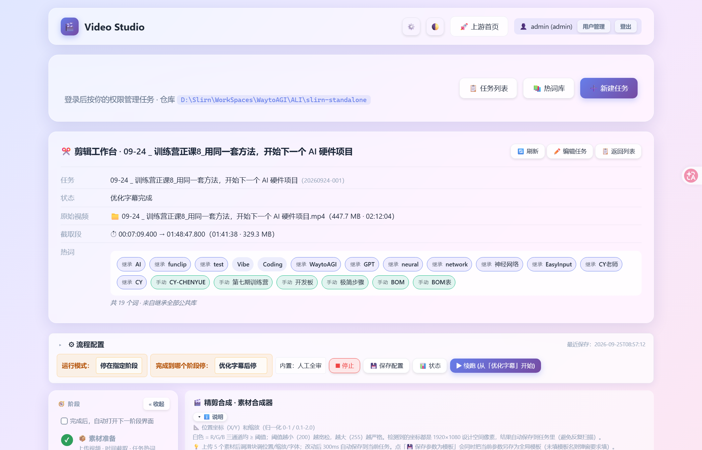

- **顶栏**：任务名 + 🔄 刷新 / 🧭 展开阶段 / ✏️ 编辑任务 / 📋 返回列表。
- **左侧 🧭 阶段栏**：七个阶段 + 📜 执行日志，按流程顺序排列。图标状态：✓ 绿色 = 已完成（按磁盘产物判断，服务重启也不丢）、高亮 = 当前、灰 = 待执行。栏可收起以加宽工作区。
- **「完成后，自动打开下一阶段界面」复选框**：勾上后，当前阶段的工作完成（识别 / 保存 / 合成完成）时自动跳到下一阶段页面，全程少点一次按钮。
- **右侧工作区**：显示当前选中阶段的操作面板。
- 顶栏下方是 **⚙ 流程配置面板** 与 **状态条** 挂载点（见[第 11 节](#11-流程配置自动执行)）。

URL 会带上 `#wb=阶段` 锚点，刷新页面（F5）自动回到当前阶段。

---

## 8. 六个阶段详解

### 8.1 字幕生成

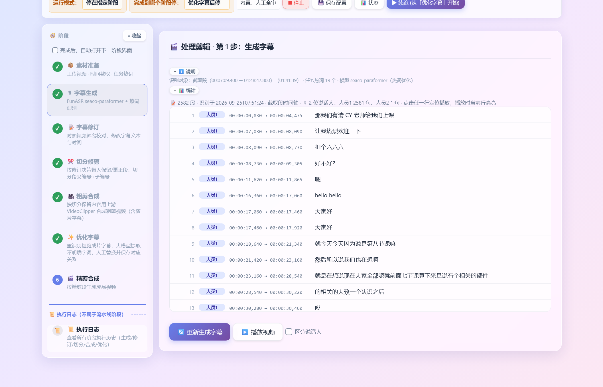

点击「🎙 开始识别」，系统用 FunASR（seaco-paraformer 模型）识别字幕，任务热词与公共热词自动生效。多人课程建议勾选 **区分说话人**，识别出的人员编号在后续「自动关联人员ID」中会用到；单人视频可关闭以减少误分。识别进度实时显示，完成后下方出现字幕列表。

### 8.2 字幕修订

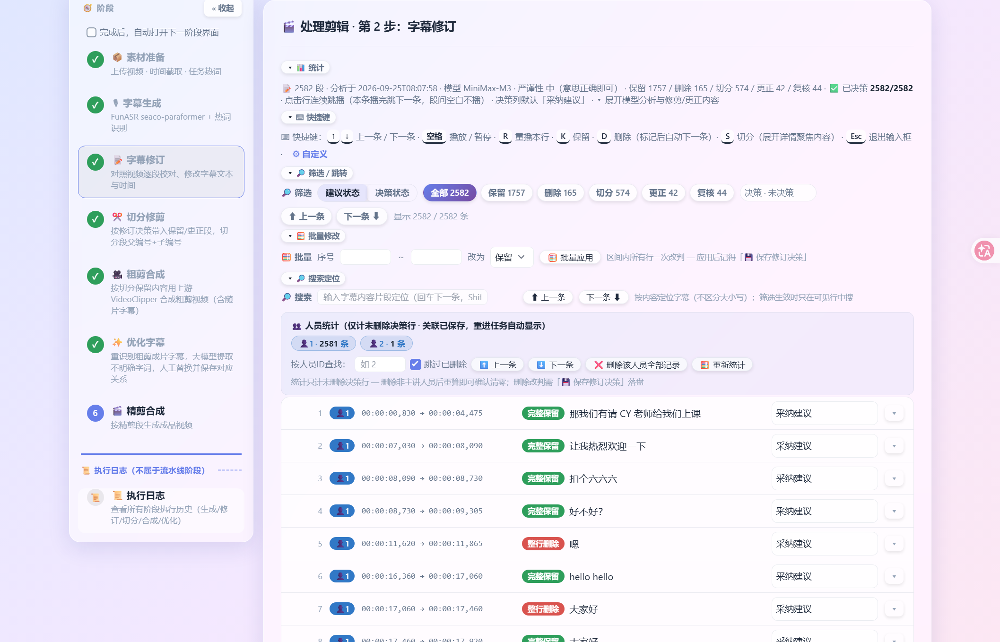

大模型逐句分析字幕并给出建议（口误、重复、不通顺、建议删除等类别）。界面上部选择 **分析严谨性级别**（四选一卡片）：

| 级别 | 效果 |
|------|------|
| 高 · 严格打磨 | 语气词、口癖、重复、无意义寒暄全部处理，接近成品口播稿 |
| 中 · 意思正确即可（默认） | 只处理影响理解的问题，小语气词保留 |
| 低 · 只去严重问题 | 最大限度保留原文，仅处理大段重复与混乱句 |
| 自 · 自定义 | 填写自定义提示词 |

每条建议可 **接受 / 拒绝**，对照视频逐段校对后保存。

### 8.3 切分修剪

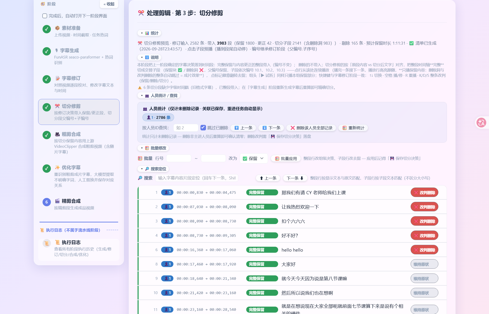

按修订阶段的决策生成分段清单：**保留段**进成片，**删除段**被剔除；修订阶段未明确决策的段落按「默认决策（保留 / 删除）」处理。每段带父编号 + 子编号，可在此微调。支持整段删除某位说话人的全部记录（用于剪掉插话、杂音）。

### 8.4 粗剪合成

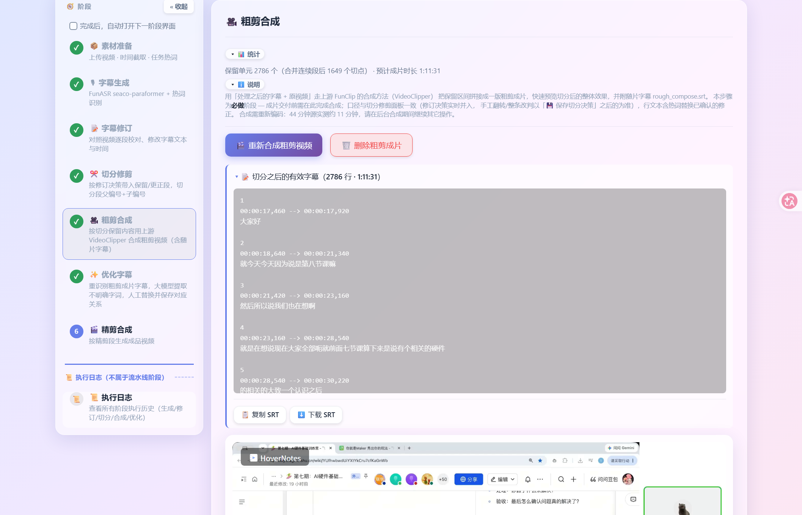

点合成按钮，系统按保留区间拼接出 **粗剪成片（rough_compose.mp4，含随片字幕）**。这一步是必做阶段——后续「优化字幕」与「精剪合成」都以粗剪成片为输入。合成进度实时显示。

### 8.5 优化字幕

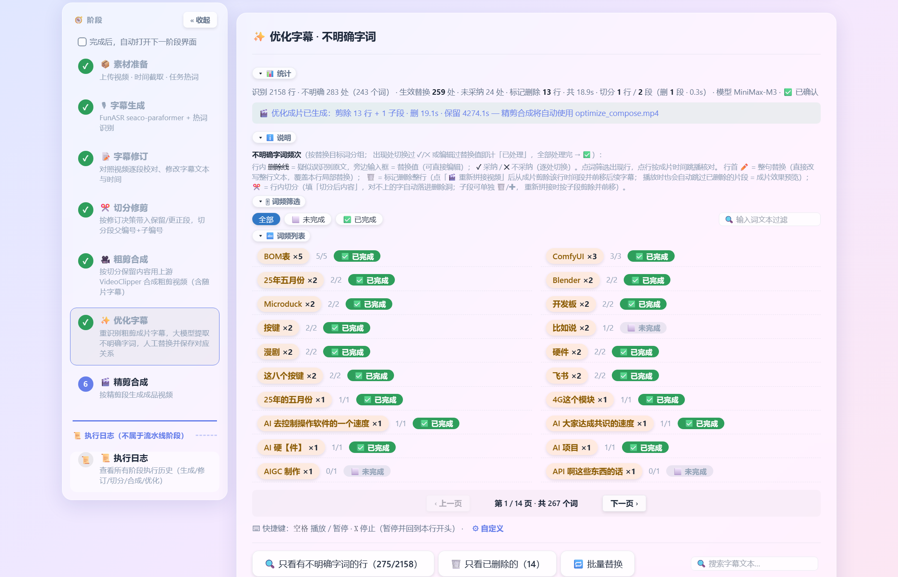

系统对粗剪成片**重新识别**字幕，大模型提取「不明确字词」（形近字、同音字等），左侧词频面板按出现次数排序。点词定位到字幕行，逐处确认替换（✅ 接受 / 改写 / 播放原文核对）。**已处理的行保持绿色常亮**，防止重复处理；处理完可点「重新拼接视频」把替换结果写回成片，按钮会显示进度百分比与已耗时，完成后有提示。

### 8.6 精剪合成

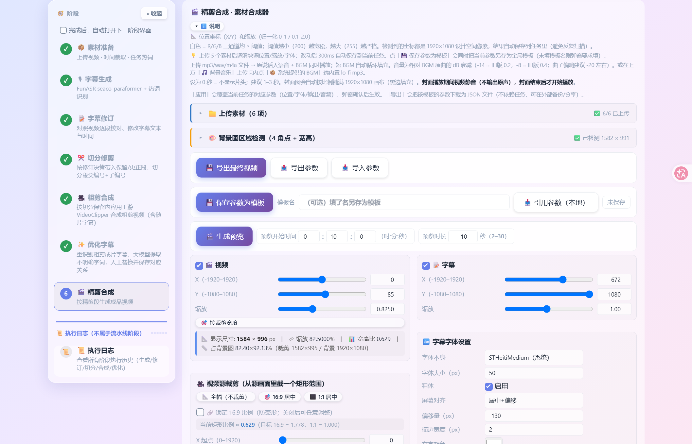

最终导出阶段。**视频与字幕自动取自上游产物，无需上传**；封面图、背景图、背景音乐（BGM）为可选素材，在此页上传并设置布局、字幕样式。导出方式两种：

- **完整导出**：整个粗剪成片重编码（1–3 小时视频耗时较长）；
- **区间导出**：只导出指定起点 + 时长的一段（如先导前 10 分钟确认效果）。

页面还提供 **合成元素调试面板**（勾选视频 / 字幕 / 封面 / 背景 / BGM 任意组合 + 起点时长，10 秒片段快速验证为什么合成结果里没有某元素）和 **🚀 一键合成** 按钮——点击后按钮变为「⏳ 合成中… X%」，完成自动弹出播放窗口。

---

## 9. 执行日志

工作台左侧点 **📜 执行日志**：

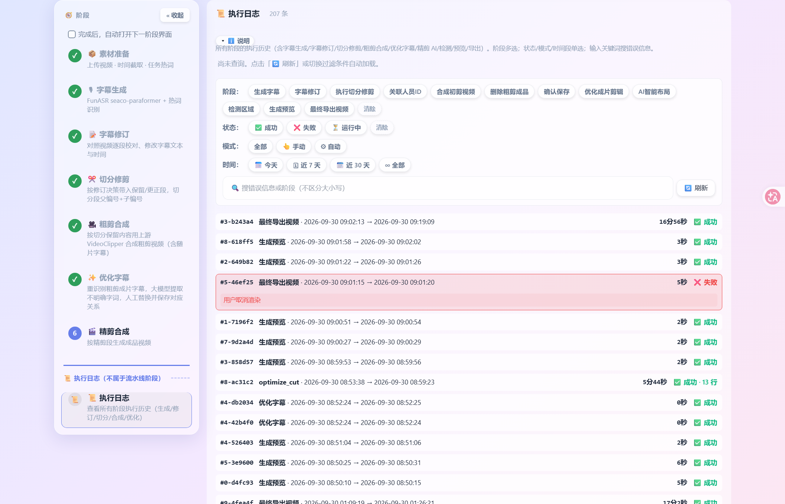

汇集所有阶段（生成 / 修订 / 切分 / 合成 / 优化 / 精剪各环节）的执行记录，支持：

- **阶段多选**：只看某几个阶段的记录；
- **状态单选**：✅ 成功 / ❌ 失败 / ⏳ 运行中；
- **模式**：手动操作 vs 流程自动执行；
- **时间段**：今天 / 近 7 天 / 近 30 天 / 全部；
- **关键词搜索**：搜错误信息；
- **分页**：每页 20 条，带首页 / 上 / 下 / 末页导航。

排查失败原因时，先把状态筛到 ❌ 失败再看错误信息。

---

## 10. 优化字幕的两个效率工具

### 10.1 查看最终字幕 · 搜索确认

优化字幕阶段点 **「查看最终字幕」**：

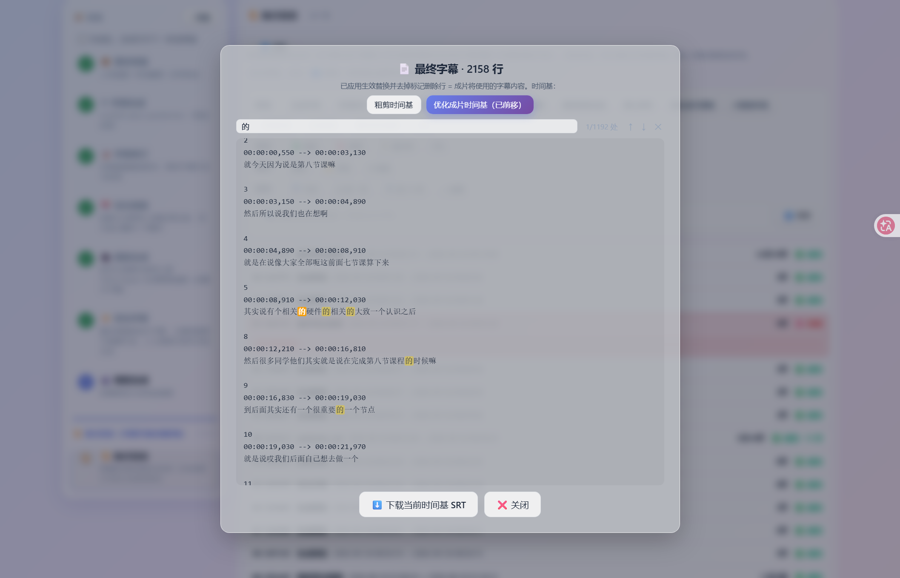

弹窗顶部是 **搜索条**，用于**确认替换是否生效**：

- 输入**新词**（替换后的正确写法）→ 应能逐处找到并高亮；
- 输入**旧词**（替换前的错误写法）→ 应显示 `未找到 · 0 处`（**0 处用绿色显示——旧词消失就是替换生效的确认信号**）；
- **Enter** 跳到下一处 / **Shift+Enter** 回上一处 / **Esc** 清空；
- 时间基默认对齐**成片**（有成品视频时），可切换到粗剪基对照。

### 10.2 批量替换

点工具栏 **🔁 批量替换**：

左侧输入要搜的词 → 点查找，每处命中显示 **该词 + 所在字幕行前后各两行（共 5 行上下文）**，阻断行（整句替换 / 已切分 / 已标删）会标注原因但不替换；右侧输入替换文字 → 点 **确认替换**，一次替换全部可替换处。适合处理「同一个错字贯穿全片」的情况（如课程名、讲师名写错）。

---

## 11. 流程配置（自动执行）

工作台顶部的 **⚙ 流程配置** 面板把 6 个阶段串成自动流水线。**面板默认折叠，点击「⚙ 流程配置」标题行展开**：

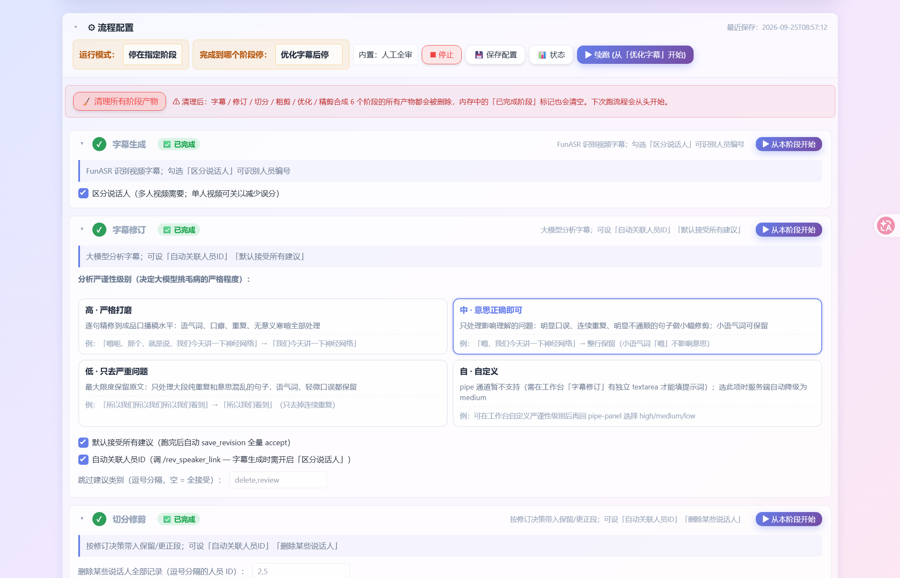

**头部控制区**（从左到右）：

| 控件 | 说明 |
|------|------|
| 运行模式 | 「停在指定阶段」（配合下面的停点）或「一键跑到底」（6 阶段连续执行） |
| 完成到哪个阶段停 | 6 个停点选项 + 不停（跑到底）；切「一键跑到底」时此下拉禁用 |
| 模板 | 内置三套：**人工全审**（字幕修订后停，人工审建议）· **半自动**（粗剪合成后停，先看粗剪）· **全自动**（跑到底）；改动任何选项后自动变「自定义」 |
| ⏹ 停止 | 中断正在运行的流水线 |
| 💾 保存配置 | 只保存不运行 |
| ▶ 从头跑 / ▶ 续跑 | 启动流水线；**续跑按钮自动计算上次跑到哪**，从断点下一阶段继续，跳过已完成阶段 |

**🧹 清理所有阶段产物**（面板顶部红色按钮）：删除本任务 6 个阶段的全部产物（字幕 / 修订 / 切分 / 粗剪 / 优化 / 精剪文件），任务回退到草稿状态，原视频、时间截取、热词保留。有两次确认，不可撤销，慎用。

**六个阶段区段**（各自可折叠，右侧有「▶ 从本阶段开始」按钮）：

- **① 字幕生成**：区分说话人（默认 ✓）；
- **② 字幕修订**：严谨性四档卡片 + 默认接受所有建议（默认 ✓）+ 自动关联人员ID（默认 ✓）+ 跳过建议类别；
- **③ 切分修剪**：删除某些说话人 + 默认决策 + 自动关联人员ID；
- **④ 粗剪合成**：无额外选项；
- **⑤ 优化字幕**：默认接受所有替换（默认 ✓）；
- **⑥ 精剪合成**：见下。

> **复选框默认全选**：五个自动化复选框（区分说话人 / 接受所有建议 ×2 / 关联人员ID ×2）默认全部勾选，开箱即全自动；之前明确保存过「不勾」的任务保留原选择。

**⑥ 精剪合成区段**：

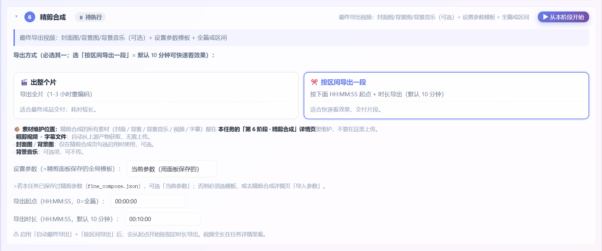

导出方式是**单选卡片**，二选一：

| 卡片 | 含义 | 适用 |
|------|------|------|
| 🎬 出整个片 | 全片重编码（1–3 小时） | 最终成品交付 |
| ✂️ 按区间导出一段（默认） | 从起点按时长导出（默认 10 分钟） | 快速看效果、交付片段 |

配 **导出起点 / 时长**（HH:MM:SS 格式，选「出整个片」时置灰）与 **设置参数**（当前参数 = 精剪合成页保存过的配置；或选模板 / 导入 JSON）。封面、背景、BGM 等素材在「第 6 阶段 · 精剪合成」详情页维护，不在此处上传。

**运行中的反馈**：启动后出现**可拖动的状态条**（当前阶段、进度条、最近 3 条日志；点 ▾ 收起，头部「📊 状态」恢复）。六个阶段区段各自显示徽章：⏳ 运行中 · N% · 已耗时 / ✅ 已完成 / ⚠️ 已跳过（配置关闭没真跑）/ ❌ 出错 / ⏸ 待执行。流水线跑完（running → 终态）产物浏览器会自动刷新一次。

---

## 12. 产物浏览器

流程配置面板底部（展开后）是 **📦 产物浏览器**——本任务所有产出文件一站式查看：

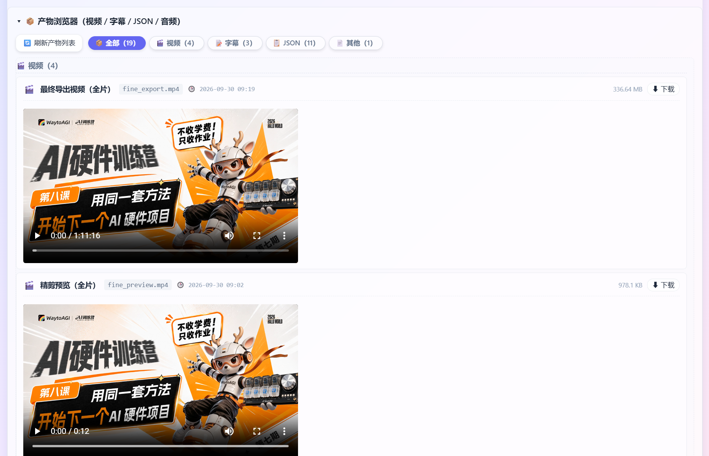

点「🔄 刷新产物列表」加载，按类别分组并给出 **分类筛选 chip**（🎬 视频 / 📝 字幕 / 🎵 音频 / 🖼 图片 / 📋 JSON / 📜 日志 / 📄 其他，各带数量）。每条产物显示文件名、最后修改时间、大小，并且：

- **视频 / 音频**：就地播放预览；
- **字幕 / JSON**：展开查看内容（懒加载，超长自动截断）；
- 所有文件均可 **⬇ 下载**。

不必再翻服务器目录找 `fine_export_*.mp4` 之类的文件——导出的成品视频在这里直接播放、直接下载。

---

## 13. 大模型设置

顶栏 **⚙️** 打开大模型设置（字幕修订、优化字幕、AI 热词分析都用到大模型）：

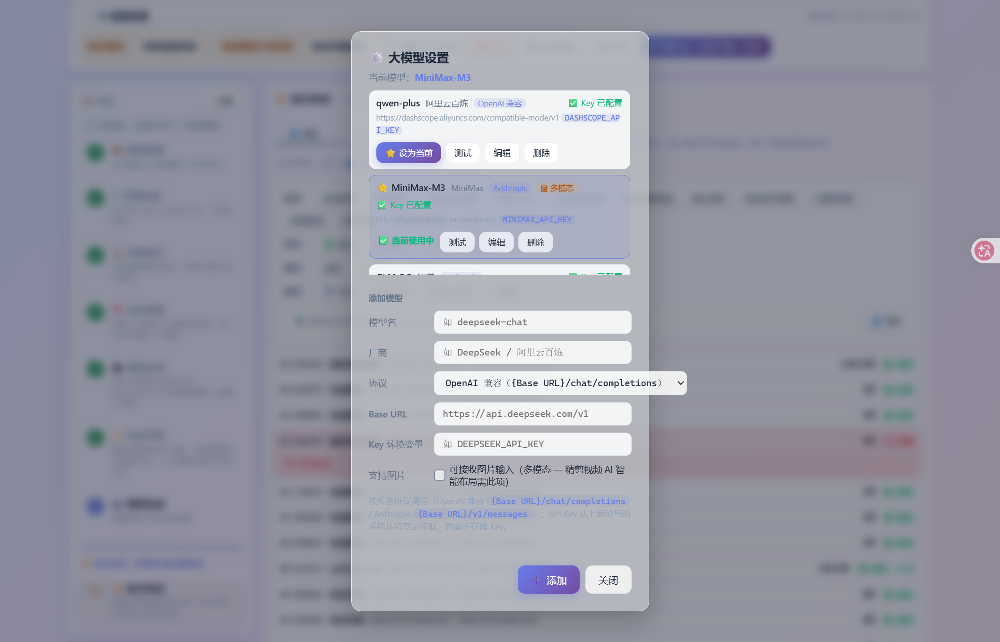

- **当前模型**：显示正在使用的模型（⭐ 标记）；
- **模型列表**：每个模型可「设为当前 / 测试连通性 / 编辑 / 删除」；
- **添加模型**：填模型名、厂商、协议（OpenAI 兼容 `{Base URL}/chat/completions` 或 Anthropic `{Base URL}/v1/messages`）、Base URL、**Key 环境变量名**（如 `DEEPSEEK_API_KEY`——界面只填变量名，**API Key 本身从系统环境变量读取，界面不存储**）；勾选「支持图片」用于需要多模态的精剪 AI 智能布局。

添加后点「测试」验证连通，再「设为当前」即可全局生效。

---

## 14. 用户管理与多人协作

管理员点击顶栏 **用户管理**：

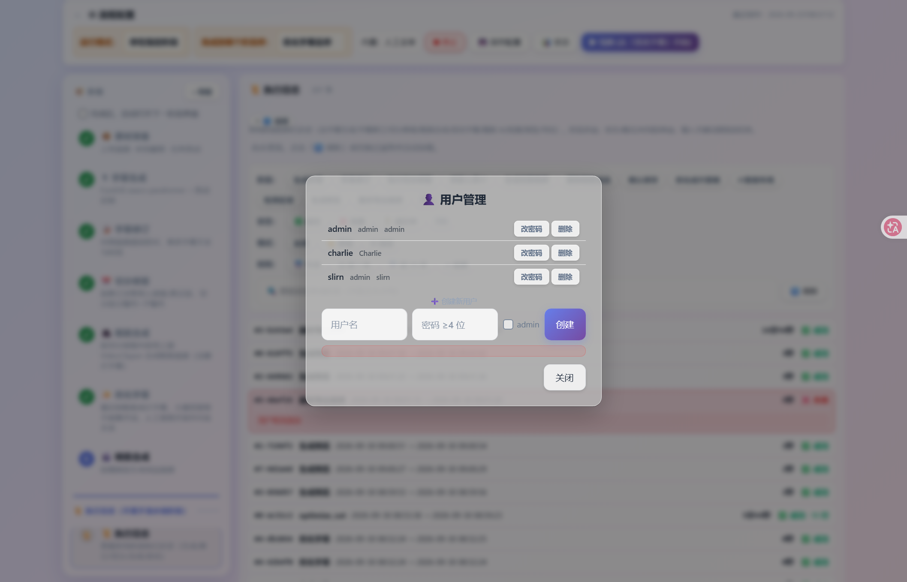

- 查看现有用户列表；
- **创建新用户**：用户名 + 密码（≥4 位）+ 是否 admin，点创建即生效。

**多人协作**：在任务的「👥 成员管理」中把同事加为成员，成员即可查看并编辑该任务；创建者与管理员始终有权限。普通用户登录后只看到自己的任务与统计数据。

---

## 15. 常见问题

| 现象 | 原因与处理 |
|------|-----------|
| 导出的视频里字幕看不清 / 出现白框 | 已知历史问题（默认字幕颜色为白、背景图透明区被当白色渲染），当前版本已修复（黑底衬底）。仍异常时在精剪合成页调整字幕颜色 |
| 合成结果里没有背景音乐（BGM） | 多为**输入视频本身损坏**导致整体合成失败。用精剪合成页的调试面板（只勾视频 + BGM、10 秒区间）快速定位；「探测输出音频」可查看输出文件的音频流与音量 |
| 长视频导出被提前截断（音频比预期短） | 已知 ffmpeg 竞态问题，当前版本已用两段式渲染修复；如再出现，看执行日志中该次导出记录 |
| 点了合成 / 拼接按钮一直「合成中」 | 进度靠轮询，直接 **刷新页面（F5）** 会自动恢复进度显示；仍未恢复去执行日志看是否失败 |
| 页面很卡 / 启动服务报内存不足（WinError 1455） | 关闭其他占用内存的服务（如 7860 上游界面）后重试；长视频合成前确保可用内存充足 |
| 专有名词识别错误 | 补热词：任务级（新建任务步骤 3）或公共库；已生成的任务可 ✏️ 编辑追加后重新识别 |
| 忘记密码 / 需要新账号 | 联系管理员在「用户管理」中创建 |
| 想看某次操作为什么失败 | 工作台 → 📜 执行日志 → 状态筛「❌ 失败」→ 看错误信息 |

---

*本说明书截图由 `tools/take_manual_screenshots.py`（Edge 无头浏览器驱动）自动截取，系统界面更新后可重新运行生成。*
